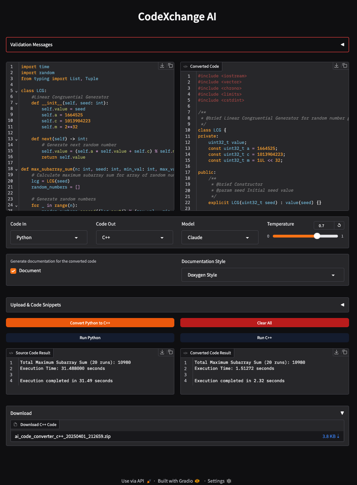

# CodeXchange AI

[](https://python.org)
[](LICENSE)
[](https://github.com/alakob/ai_code_converter/actions/workflows/python-test.yml)

A powerful tool for converting and executing code between programming languages using AI models.

## Overview

CodeXchange AI translates code between programming languages while maintaining functionality and idiomatic patterns, with support for real-time execution.

  
*Screenshot: Converted code with documentation, ready to run*

## Key Features

- Multi-language code conversion (17 programming languages)
- Real-time code execution
- Multiple AI model support (GPT, Claude, DeepSeek, GROQ, Gemini)
- File upload/download functionality
- Syntax highlighting
- Detailed logging

## Quick Start

### Using Docker (Recommended)

```bash
# Clone the repository
git clone git@github.com:alakob/ai_code_converter.git
cd ai_code_converter

# Configure environment
cp .env.example .env
# Edit .env with your API keys

# Make the script executable
chmod +x run-docker.sh

# Run the application
./run-docker.sh
```

The application will be available at `http://localhost:7860`

Docker wrapper script options:
```bash
./run-docker.sh -d         # Run in detached mode
./run-docker.sh -p 8080    # Run on port 8080
./run-docker.sh -s         # Stop the container
./run-docker.sh -h         # Show help message
```

### Manual Installation

```bash
# Create and activate virtual environment
python -m venv .venv
source .venv/bin/activate  # On Windows: .venv\Scripts\activate

# Install dependencies
pip install -r requirements.txt

# Configure environment
cp .env.example .env
# Edit .env with your API keys

# Run the application
python run.py
```

## Supported Languages

- Python, JavaScript, Java, C++, TypeScript
- Go, Ruby, Swift, Rust, C#
- R, Perl, Lua, PHP, Kotlin, SQL, Julia

See [Supported Languages](./docs/languages.md) for detailed information.

## Known Issues and Considerations

### Language Detection and Code Execution

- **Language Detection**: The application uses heuristics to detect the language of your code. While generally accurate, it may not always correctly identify code with ambiguous syntax. Always verify the selected source language before conversion.

- **Code Execution**: Code snippets using `if __name__ == "__main__":` guards will run properly in the execution environment. However, complex code with high computational complexity might appear unresponsive due to execution time.

- **Execution Limitations**: For security reasons, code execution occurs in isolated environments with restricted access to system resources. Some language-specific features may not be available.

## Documentation

- [Configuration Guide](./docs/configuration.md)
- [Development Guide](./docs/development.md)
- [Contributing Guidelines](./docs/contributing.md)
- [Project Structure](./docs/project_structure.md)
- [Architecture Diagram](./docs/architecture_diagram.md)

## App Overview & Notebook Version

The application provides an intuitive interface with:
- Code editor with syntax highlighting
- Language selection dropdowns
- Model and temperature settings
- Documentation options
- File upload/download capabilities

For a lightweight experience, you can also use our Jupyter notebook version:
- [codeXchange.ipynb](./codeXchange.ipynb) - Run the converter in a Jupyter environment

## License

This project is licensed under the MIT License - see the [LICENSE](LICENSE) file for details. 