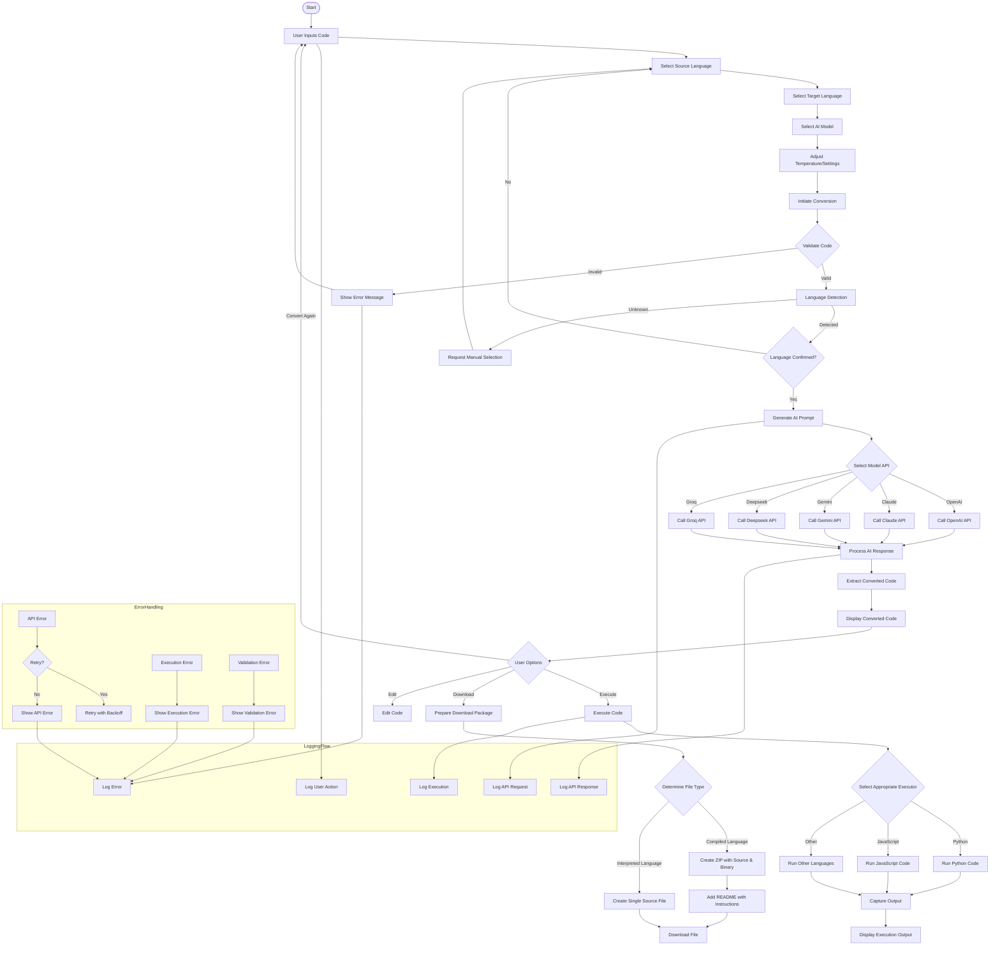

# CodeXchange AI - Detailed Application Diagram and Data Flow

This document provides a comprehensive visualization of the CodeXchange AI application architecture, component relationships, and data flows.

## Application Component Relationships

The following diagram shows the major components of the application and their relationships:

```mermaid
graph TD
    %% Main Application & User Interface
    User((User)) --> GradioUI[Gradio UI]
    CodeConverterApp[CodeConverterApp] --> GradioUI
    
    %% Core Components
    CodeConverterApp --> ModelStreamer[AIModelStreamer]
    CodeConverterApp --> LangDetector[LanguageDetector]
    CodeConverterApp --> CodeExec[CodeExecutor]
    CodeConverterApp --> FileHandler[FileHandler]
    
    %% AI Model Integrations
    ModelStreamer --> OpenAI[OpenAI API]
    ModelStreamer --> Claude[Claude API]
    ModelStreamer --> Deepseek[Deepseek API]
    ModelStreamer --> Groq[Groq API]
    ModelStreamer --> Gemini[Gemini API]
    
    %% Config and Templates
    Config[Config Module] --> CodeConverterApp
    Template[Jinja2 Template] --> CodeConverterApp
    
    %% Data Flow
    GradioUI -->|Source Code| CodeConverterApp
    GradioUI -->|Language Selection| CodeConverterApp
    GradioUI -->|Model Selection| CodeConverterApp
    GradioUI -->|Temperature Setting| CodeConverterApp
    
    %% Code Conversion Flow
    CodeConverterApp -->|Source Code| LangDetector
    LangDetector -->|Validation| CodeConverterApp
    CodeConverterApp -->|Prompt| ModelStreamer
    ModelStreamer -->|AI Response| CodeConverterApp
    CodeConverterApp -->|Converted Code| GradioUI
    
    %% File Handling
    GradioUI -->|Upload| FileHandler
    FileHandler -->|Processed File| CodeConverterApp
    CodeConverterApp -->|Download| FileHandler
    FileHandler -->|Download File| GradioUI
    
    %% Code Execution
    GradioUI -->|Execute Code| CodeExec
    CodeExec -->|Execution Result| GradioUI
    
    %% Subgraphs for logical grouping
    subgraph Core
        CodeConverterApp
        LangDetector
        CodeExec
        FileHandler
        ModelStreamer
    end
    
    subgraph External_Services
        OpenAI
        Claude
        Deepseek
        Groq
        Gemini
    end
    
    subgraph Configuration
        Config
        Template
    end
    
    %% Language Execution Components
    subgraph Code_Execution
        PythonExec[Python Executor]
        JavaScriptExec[JavaScript Executor]
        JavaExec[Java Executor]
        CppExec[C++ Executor]
        GoExec[Go Executor]
        RubyExec[Ruby Executor]
        OtherExec[Other Language Executors]
        
        CodeExec --> PythonExec
        CodeExec --> JavaScriptExec
        CodeExec --> JavaExec
        CodeExec --> CppExec
        CodeExec --> GoExec
        CodeExec --> RubyExec
        CodeExec --> OtherExec
    end
    
    %% App Initialization Flow
    Init[App Initialization] --> LoadEnv[Load Environment Variables]
    LoadEnv --> InitClients[Initialize AI Clients]
    InitClients --> CreateGradioUI[Create Gradio Interface]
    CreateGradioUI --> SetupEventHandlers[Setup Event Handlers]
    SetupEventHandlers --> RunApp[Run Application]
```



## Detailed Data Flow Diagram

This diagram illustrates the specific data flow patterns within the application:



## File Structure and Relationships

```mermaid
graph TD
    %% Main Application Structure
    App[app.py] --> Config[config.py]
    App --> Main[main.py]
    
    %% Core Components
    App --> Core{Core Components}
    Core --> LangDetection[language_detection.py]
    Core --> CodeExecution[code_execution.py]
    Core --> FileUtils[file_utils.py]
    
    %% Models
    App --> Models{Models}
    Models --> AIStreaming[ai_streaming.py]
    
    %% Utils
    App --> Utils{Utilities}
    Utils --> Logger[logger.py]
    
    %% Template
    App --> Template[template.j2]
    
    %% Supporting Files
    Setup[setup.py] --> App
    Run[run.py] --> App
    
    %% Resource Directories
    Logs{logs/} --- Logger
    Downloads{downloads/} --- FileUtils
    
    %% Configuration Files
    DotEnv[.env] --> App
    DotEnvExample[.env.example] -.- DotEnv
    DockerFile[Dockerfile] --> App
    DockerCompose[docker-compose.yml] --> DockerFile
    
    %% Documentation
    Docs{docs/} -.- App
</rewritten_file> 